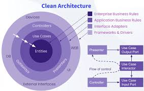

# simple-CURD-GoLang
## Framework
- GIN
- GORM
## Clean architecture

### SQL - MYSQL
Gồm 3 bảng cơ bản roles, users, và account
roles many to one với users, và users one to one account
**Diagram**

### Deloy Docker